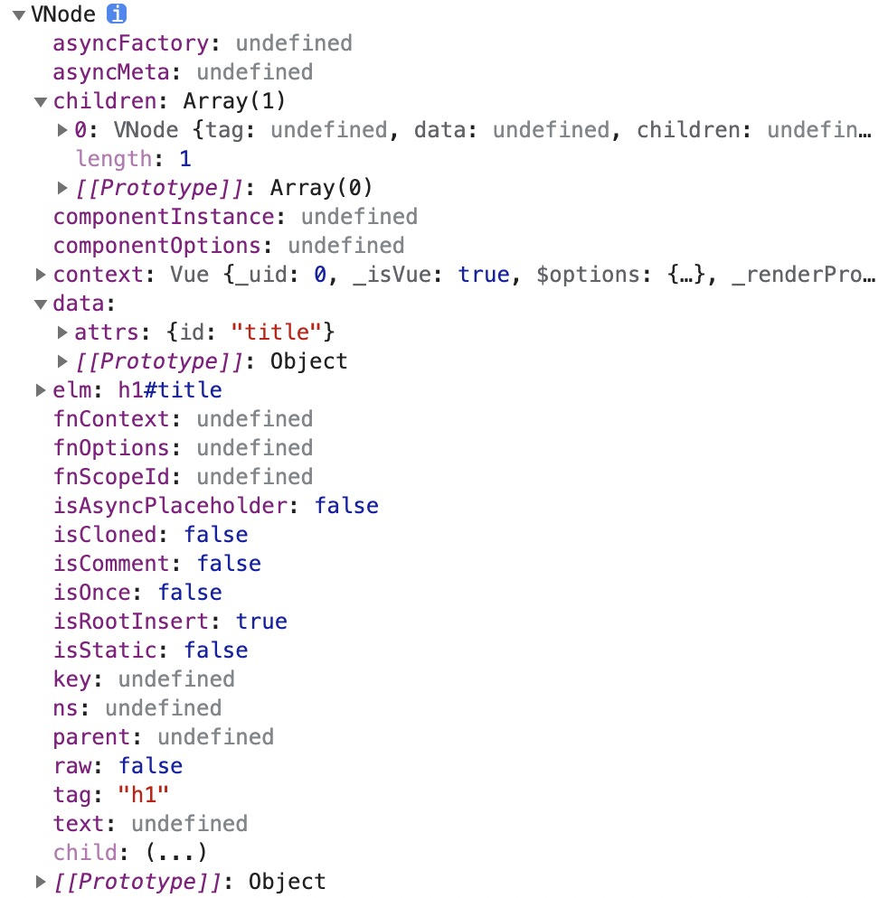

# Virtual-DOM

## 创建过程

在 vue 组件创建的过程中，我们可以通过手写 render 函数来进行。

创建方式如下所示：

```js
// example/1-virtualdom.html
const vm = new Vue({
  el: '#app',
  render (h) {
    // h(tag, data, children)
    // return h('h1', this.msg)
    // return h('h1', { domProps: { innerHTML: this.msg } })
    // return h('h1', { attrs: { id: 'title' } }, this.msg)
    const vnode = h(
      'h1', 
      { 
        attrs: { id: 'title' } 
      },
      this.msg
    )
    console.log(vnode)
    return null
  },
  data: {
    msg: 'Hello Vue'
  }
})
```

此时，我们可以通过 render 函数提供 h 函数，创建一个 vnode，并通过返回 vnode 的方法进行组件的创建。

### h 函数

- 对应于 vue 提供的 vm.$createElement(tag, data, children, normalizeChildren)
  - tag
    - 标签名称或者组件名称
  - data
    - 描述 tag，可以设置 DOM 的属性或者标签的属性
  - children
    - tag 中的文本内容或者子节点

> 详细使用：[渲染函数 & JSX — Vue.js](https://cn.vuejs.org/v2/guide/render-function.html)

### vnode

而通过 h 函数创建的 vnode，如下图所示。



其中，以下为核心属性：

- tag：标签名
- data：data 选项
- children：子节点，当最后一个参数设置为字符串时，会 自动转换成一个 vnode 对象，用来描述文本节点
- text：文本节点
- elm：记录真实 DOM
- key：用于复用元素，diff 中会使用

## 整体过程分析

## createElement