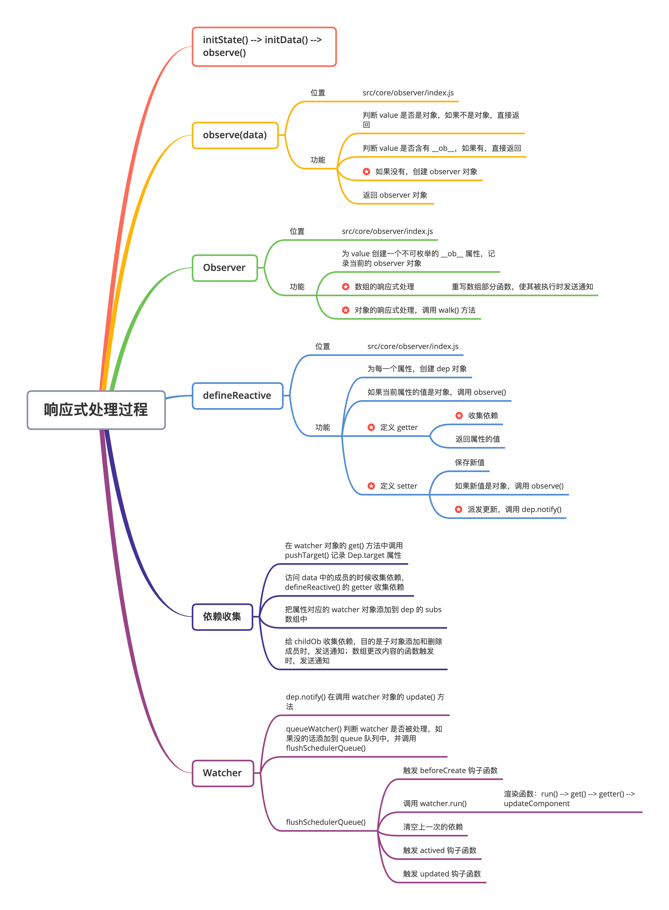

# 响应式原理



## 处理入口

响应式的相关代码位于：

- src/core/instance/init.js
  - initState(vm)	vm 状态的初始化
  - 初始化了 _data、 _props、 methods 等
- src/core/instance/state.js
  - 在该文件中，将 options.data 通过 observe 函数，将 data 转换为响应式对象。

```js
	// 数据初始化
	if (opts.data) {
    initData(vm)
  } else {
    observe(vm._data = {}, true /* asRootData */)
  }

// ...

function initData (vm: Component) {
  let data = vm.$options.data
  // 初始化 _data，组件中 data 是函数，调用函数返回结果
  // 否则直接返回 data
  data = vm._data = typeof data === 'function'
    ? getData(data, vm)
    : data || {}
  if (!isPlainObject(data)) {
    data = {}
    process.env.NODE_ENV !== 'production' && warn(
      'data functions should return an object:\n' +
      'https://vuejs.org/v2/guide/components.html#data-Must-Be-a-Function',
      vm
    )
  }
  // proxy data on instance
  // 提取 data 中的所有属性
  const keys = Object.keys(data)
  // 获取 props / methods
  const props = vm.$options.props
  const methods = vm.$options.methods
  let i = keys.length
  // 判断 data 上的成员是否和 props/methods 重名
  while (i--) {
    const key = keys[i]
    if (process.env.NODE_ENV !== 'production') {
      if (methods && hasOwn(methods, key)) {
        warn(
          `Method "${key}" has already been defined as a data property.`,
          vm
        )
      }
    }
    if (props && hasOwn(props, key)) {
      process.env.NODE_ENV !== 'production' && warn(
        `The data property "${key}" is already declared as a prop. ` +
        `Use prop default value instead.`,
        vm
      )
    } else if (!isReserved(key)) {
      proxy(vm, `_data`, key)
    }
  }
  // observe data
  // 响应式处理
  observe(data, true /* asRootData */)
}
```

- src/core/observer/index.js
  - 该文件定义了 observe()，Observer 类等，用于将数据转换成响应式对象

```js
/**
 * Attempt to create an observer instance for a value,
 * returns the new observer if successfully observed,
 * or the existing observer if the value already has one.
 */
export function observe (value: any, asRootData: ?boolean): Observer | void {
  // 判断 value 是否是对象
  if (!isObject(value) || value instanceof VNode) {
    return
  }
  // ob 为 类 Observer 的一个实例
  let ob: Observer | void
  // 如果 value 有 __ob__ (observer 对象) 属性，结束
  if (hasOwn(value, '__ob__') && value.__ob__ instanceof Observer) {
    // 已声明为响应式数据，返回
    ob = value.__ob__
  } else if (
    shouldObserve &&
    !isServerRendering() &&
    (Array.isArray(value) || isPlainObject(value)) &&
    Object.isExtensible(value) &&
    !value._isVue
  ) {
    // 创建一个 Observer 对象
    ob = new Observer(value)
  }
  if (asRootData && ob) {
    ob.vmCount++
  }
  return ob
}
```

## Observer

- 定义于 src/core/observer/index.js 文件中。
- 其作用是将数组或对象做响应式处理，将其包含的每一个值进行 getter/setter 处理，用于依赖收集及派发更新。 

```js
export class Observer {
  // 观察对象
  value: any;
  // 依赖对象
  dep: Dep;
  // 实例计数器
  vmCount: number; // number of vms that have this object as root $data

  constructor (value: any) {
    this.value = value
    this.dep = new Dep()
    // 初始化实例的 vmCount 为 0
    this.vmCount = 0
    // 将实例挂载到观察对象的 __ob__ 属性
    def(value, '__ob__', this)
    if (Array.isArray(value)) {
      // 数组的响应式处理
      if (hasProto) {
        protoAugment(value, arrayMethods)
      } else {
        copyAugment(value, arrayMethods, arrayKeys)
      }
      // 为数组中的每一个对象创建一个 observer 实例
      this.observeArray(value)
    } else {
      // 遍历对象的每一个属性，转换成 setter/getter
      this.walk(value)
    }
  }

  /**
   * Walk through all properties and convert them into
   * getter/setters. This method should only be called when
   * value type is Object.
   */
  walk (obj: Object) {
    // 获取观察对象的每一个属性
    const keys = Object.keys(obj)
    for (let i = 0; i < keys.length; i++) {
      // 遍历每一个属性，设置为响应式数据
      defineReactive(obj, keys[i])
    }
  }

  /**
   * Observe a list of Array items.
   */
	// 对数组进行响应式处理
  observeArray (items: Array<any>) {
    for (let i = 0, l = items.length; i < l; i++) {
      observe(items[i])
    }
  }
}
```

## defineReactive

- 定义于 src/core/observer/index.js 文件中。
- 用于在 Observer 实例中，将 value 的每一个属性通过 Object.defineProperty() 设置 gettter / setter。

```js
// 为一个对象定义一个响应式的属性
export function defineReactive (
  obj: Object,
  key: string,
  val: any,
  customSetter?: ?Function,
  // 为 true 时，只监听数据的第一层属性
  shallow?: boolean
) {
  // 创建依赖对象实例，收集观察对象 key 的所有 w atcher
  const dep = new Dep()
  // 获取 obj 的属性描述符对象
  const property = Object.getOwnPropertyDescriptor(obj, key)
  // property.configurable 为 false， 无法通过 defineProperty 设置
  if (property && property.configurable === false) {
    return
  }

  // 提供预定义的存取器函数
  // cater for pre-defined getter/setters
  const getter = property && property.get
  const setter = property && property.set
  if ((!getter || setter) && arguments.length === 2) {
    val = obj[key]
  }

  // 判断是否递归观察子对象，并将子对象属性都转换成 getter/setter，返回子观察对象
  let childOb = !shallow && observe(val)
  Object.defineProperty(obj, key, {
    enumerable: true,
    configurable: true,
    get: function reactiveGetter () {
      // 如果预定义的 getter 存在，则 value 等于 getter 调用的返回值，否则直接赋值
      const value = getter ? getter.call(obj) : val
      // 如果存在当前依赖目标，即 watcher 对象，则建立依赖
      if (Dep.target) {
        dep.depend()
        // 如果子观察目标存在，建立自对象的依赖关系
        if (childOb) {
          childOb.dep.depend()
          // 如果属性是数组，则特殊处理收集数组对象依赖
          if (Array.isArray(value)) {
            dependArray(value)
          }
        }
      }
      // 返回属性值
      return value
    },
    set: function reactiveSetter (newVal) {
      // 如果预定义的 getter 存在，则 value 等于 getter 调用的返回值，否则直接赋予属性值
      const value = getter ? getter.call(obj) : val
      /* eslint-disable no-self-compare */
      // 如果新值等于旧值或者新值旧值为 NaN 则不执行
      if (newVal === value || (newVal !== newVal && value !== value)) {
        return
      }
      /* eslint-enable no-self-compare */
      if (process.env.NODE_ENV !== 'production' && customSetter) {
        customSetter()
      }
      // #7981: for accessor properties without setter
      // 如果只存在 getter，不存在 setter 直接返回
      if (getter && !setter) return
      // 如果预定义 setter 存在则调用，否则直接更新新值
      if (setter) {
        setter.call(obj, newVal)
      } else {
        val = newVal
      }
      // 如果新值是对象，观察子对象并返回子的 observer 对象
        = !shallow && observe(newVal)
      // 派发更新（发送更改通知）
      dep.notify()
    }
  })
}
```

## 依赖收集

- 在 defineReactive() 函数中，我们给属性定义了 getter 跟 setter 两个方法， 当访问这个属性的值的时候，就会进行依赖的收集。
- 依赖收集的本质是将依赖该属性的 watcher 对象添加到  dep 对象的 subs 数组中。当数据发生变化时，通知所有的 watcher。
- dep 存在于两个地方：
  - observer 对象中含有一个属性 dep 对象
    -  为当前这个子对象收集依赖：当子对象的成员发生添加或删除时触发
  - defineReactive 方法中给每个属性创建了一个 dep 对象
    - 负责收集每一个属性的依赖

在创建 watcher 过程中，调用 wather 对象的 get 方法时，通过 pushTarget 方法，将当前 watcher 对象赋值给 Dep.target。

在 vue2.x 中，每一个组件对应一个 watcher 对象，当组件间有嵌套时（a 组件渲染了 b 组件），当渲染 b 组件时，a 组件的渲染将会被挂载起来，因此 a 组件对应的 watcher 对应也会被挂载起来，放入 targetStack 栈中。当 b 组件渲染完成，会将 b 组件对应的 watcher 从栈中移除，再获取 a 组件对应的 watcher。

```js
// Dep.target 用来存放目前正在使用的 watcher
// 全局唯一，并且一次也只能有一个 watcher 被使用
Dep.target = null
const targetStack = []

// 入栈，并将当前 watcher 赋值给 Dep.target
export function pushTarget (target: ?Watcher) {
  targetStack.push(target)
  Dep.target = target
}

export function popTarget () {
  // 出栈操作
  targetStack.pop()
  Dep.target = targetStack[targetStack.length - 1]
}
```

当调用 dep.depend() 方法时，会将观察对象与 watcher 建立依赖，此时对应的 watcher 对象会被存放至 subs 数组中。 

```js
let uid = 0

/**
 * A dep is an observable that can have multiple
 * directives subscribing to it.
 */
// dep 是个可观察对象，可以有多个指令订阅它
export default class Dep {
  // 静态属性，指代 watcher 对象
  static target: ?Watcher;
  // dep 实例 id
  id: number;
  // dep 实例对应的 watcher 对象/订阅者数组
  subs: Array<Watcher>;

  constructor () {
    this.id = uid++
    this.subs = []
  }

  // 添加新的订阅者 watcher 对象
  addSub (sub: Watcher) {
    this.subs.push(sub)
  }

  // 移除订阅者
  removeSub (sub: Watcher) {
    remove(this.subs, sub)
  }

  // 将观察对象与 watcher 建立依赖
  depend () {
    if (Dep.target) {
      // 如果 target 存在，把 dep 对象添加到 watcher 的依赖中
      Dep.target.addDep(this)
    }
  }
}
```

```js
export default class Watcher {
  // ...
  addDep (dep: Dep) {
    const id = dep.id
    if (!this.newDepIds.has(id)) {
      this.newDepIds.add(id)
      this.newDeps.push(dep)
      if (!this.depIds.has(id)) {
        dep.addSub(this)
      }
    }
  }
}
```

## 数组响应式处理

数组的响应处理主要是要在 类 Observer 实例化的构造函数中。

```js
export class Observer {
  // ...
  constructor (value: any) {
    // ...
    if (Array.isArray(value)) {
      // 数组的响应式处理
      // 判断浏览器是否支持 __proto__
      if (hasProto) {
        protoAugment(value, arrayMethods)
      } else {
        copyAugment(value, arrayMethods, arrayKeys)
      }
      // 为数组中的每一个对象创建一个 observer 实例
      this.observeArray(value)
    } else {
      // ...
    }
  }
  observeArray (items: Array<any>) {
    for (let i = 0, l = items.length; i < l; i++) {
      observe(items[i])
    }
  }
}
```

针对数组的 push，unshift 等方法，通过这些方法的调用，而导致数组的内容发生变化时，无法通过 dep.notify() 进行视图的更新。因此，对这些方法进行了重写。

```js
const arrayProto = Array.prototype
// 使用数组的原型创建一个新的对象
export const arrayMethods = Object.create(arrayProto)
// 修改数组元素的方法
const methodsToPatch = [
  'push',
  'pop',
  'shift',
  'unshift',
  'splice',
  'sort',
  'reverse'
]
/**
 * Intercept mutating methods and emit events
 */
methodsToPatch.forEach(function (method) {
  // cache original method
  // 保存数组的原方法
  const original = arrayProto[method]
  // 调用 Object.defineProperty() 重新定义修改数组的方法
  def(arrayMethods, method, function mutator (...args) {
    // 执行数组的原方法
    const result = original.apply(this, args)
    // 获取数组对象的 ob 对象
    const ob = this.__ob__
    let inserted
    switch (method) {
      case 'push':
      case 'unshift':
        inserted = args
        break
      case 'splice':
        inserted = args.slice(2)
        break
    }
    // 对插入的新元素，重新遍历数组元素设置为响应式数据
    if (inserted) ob.observeArray(inserted)
    // notify change
    // 调用修改数组的方法，调用数组的 ob 对象发送通知
    ob.dep.notify()
    return result
  })
})
```

## Watcher

Watcher 分为三种，Computed Watcher，用户 Watcher，渲染 Watcher。

- 渲染 Watcher 的创建时机，代码位于 src/core/instance/lifecycle.js 下。

```js
// ...
	updateComponent = () => {
		vm._update(vm._render(), hydrating)
	}
	new Watcher(vm, updateComponent, noop, {
    before () {
      if (vm._isMounted && !vm._isDestroyed) {
        callHook(vm, 'beforeUpdate')
      }
    }
  }, true /* isRenderWatcher */)
```

Watcher 类的相关代码位于 src/core/observer/watcher.js 下，在创建 Watcher 实例的过程总，触发依赖收集。

```js
let uid = 0

/**
 * A watcher parses an expression, collects dependencies,
 * and fires callback when the expression value changes.
 * This is used for both the $watch() api and directives.
 */
export default class Watcher {
  vm: Component;
  expression: string;
  cb: Function;
  id: number;
  deep: boolean;
  user: boolean;
  lazy: boolean;
  sync: boolean;
  dirty: boolean;
  active: boolean;
  deps: Array<Dep>;
  newDeps: Array<Dep>;
  depIds: SimpleSet;
  newDepIds: SimpleSet;
  before: ?Function;
  getter: Function;
  value: any;

  constructor (
    vm: Component,
    expOrFn: string | Function,
    cb: Function,
    options?: ?Object,
    isRenderWatcher?: boolean
  ) {
    this.vm = vm
    if (isRenderWatcher) {
      vm._watcher = this
    }
    // 记录当前实例的 watcher，包含 Computed Watcher，用户 Watcher
    vm._watchers.push(this)
    // options
    if (options) {
      this.deep = !!options.deep
      this.user = !!options.user
      this.lazy = !!options.lazy
      this.sync = !!options.sync
      this.before = options.before
    } else {
      this.deep = this.user = this.lazy = this.sync = false
    }
    this.cb = cb
    // 唯一标识
    this.id = ++uid // uid for batching
    // 是否活动
    this.active = true
    this.dirty = this.lazy // for lazy watchers
    // 以下四个记录当前 watcher 相关的 dep 对象
    this.deps = []
    this.newDeps = []
    this.depIds = new Set()
    this.newDepIds = new Set()
    this.expression = process.env.NODE_ENV !== 'production'
      ? expOrFn.toString()
      : ''
    // parse expression for getter
    if (typeof expOrFn === 'function') {
      this.getter = expOrFn
    } else {
      // expOrFn 是字符串的时候，例如 watch: { 'person.name': function... }
      // parsePath('person.name') 返回一个函数，获取 person.name 的值
      this.getter = parsePath(expOrFn)
      if (!this.getter) {
        this.getter = noop
        process.env.NODE_ENV !== 'production' && warn(
          `Failed watching path: "${expOrFn}" ` +
          'Watcher only accepts simple dot-delimited paths. ' +
          'For full control, use a function instead.',
          vm
        )
      }
    }
    // Computed Watcher 对应的 lazy 为 true，延迟执行
    this.value = this.lazy
      ? undefined
      : this.get()
  }

  /**
   * Evaluate the getter, and re-collect dependencies.
   */
  get () {
    pushTarget(this)
    let value
    const vm = this.vm
    try {
      // 渲染 Watcher 此处执行 updateComponent
      value = this.getter.call(vm, vm)
    } catch (e) {
      if (this.user) {
        handleError(e, vm, `getter for watcher "${this.expression}"`)
      } else {
        throw e
      }
    } finally {
      // "touch" every property so they are all tracked as
      // dependencies for deep watching
      if (this.deep) {
        traverse(value)
      }
      popTarget()
      this.cleanupDeps()
    }
    return value
  }
	// ...
}
```

而当响应式对象发生变化时，会触发 dep 实例的 notify() 方法，触发所有相关的 watcher 的 update() 方法进行更新。

```js
export default class Dep {
  // ...
	// 发布通知
  notify () {
    // stabilize the subscriber list first
    const subs = this.subs.slice()
    if (process.env.NODE_ENV !== 'production' && !config.async) {
      // subs aren't sorted in scheduler if not running async
      // we need to sort them now to make sure they fire in correct
      // order
      subs.sort((a, b) => a.id - b.id)
    }
    // 调用每个订阅者的 update 方法实现更新
    for (let i = 0, l = subs.length; i < l; i++) {
      subs[i].update()
    }
  }
}
```

```js
export default class Watcher {
  // ...
 	update () {
    /* istanbul ignore else */
    if (this.lazy) {
      this.dirty = true
    } else if (this.sync) {
      this.run()
    } else {
      // 渲染 Watcher 直接执行 queueWatcher() 放入队列中执行
      queueWatcher(this)
    }
  } 
}
```

触发 watcher 实例的 watcher 方法之后，渲染 Watcher 会执行 queueWatcher() 方法，放入对列中。

在 queueWatcher() 方法中，会根据队列的处理情况，将 watcher 放入队列。

最后，触发 flushSchedulerQueue() 方法。

```js
export function queueWatcher (watcher: Watcher) {
  const id = watcher.id
  // 防止 watcher 重复处理
  if (has[id] == null) {
    has[id] = true
    // 判断是否正在刷新，代表 watcher 是否正在处理
    if (!flushing) {
      // 不在处理，则放入队列，适当时机执行
      queue.push(watcher)
    } else {
      // if already flushing, splice the watcher based on its id
      // if already past its id, it will be run next immediately.
      // 正在处理，放入适当位置
      let i = queue.length - 1
      while (i > index && queue[i].id > watcher.id) {
        i--
      }
      queue.splice(i + 1, 0, watcher)
    }
    // queue the flush
    if (!waiting) {
      waiting = true

      if (process.env.NODE_ENV !== 'production' && !config.async) {
        flushSchedulerQueue()
        return
      }
      // flushSchedulerQueue 遍历所有的 watcher，并且调用 watcher 的 run() 方法
      nextTick(flushSchedulerQueue)
    }
  }
}
```

在 flushSchedulerQueue() 方法中，对 watcher 进行了排序，最后顺序触发 watcher 的 run() 方法。

```js
function flushSchedulerQueue () {
  currentFlushTimestamp = getNow()
  // 标记正在执行
  flushing = true
  let watcher, id

  // Sort queue before flush.
  // This ensures that:
  // 1. Components are updated from parent to child. (because parent is always
  //    created before the child)
  // 2. A component's user watchers are run before its render watcher (because
  //    user watchers are created before the render watcher)
  // 3. If a component is destroyed during a parent component's watcher run,
  //    its watchers can be skipped.
  // 排序
  // 1. 确保组件的更新顺序从父组件到子组件
  // 2. 组件的 用户 Watcher 在渲染 Watcher 之前执行
  // 3. 当子组件在父组件 的 watcher 执行时被销毁，则子组件 watcher 应该被跳过
  queue.sort((a, b) => a.id - b.id)

  // do not cache length because more watchers might be pushed
  // as we run existing watchers
  for (index = 0; index < queue.length; index++) {
    watcher = queue[index]
    if (watcher.before) {
      watcher.before()
    }
    id = watcher.id
    has[id] = null
    watcher.run()
    // ...
  }
  // ...
}
```

在 run() 方法中，重新触发了 get() 方法， 此时 渲染 Watcher 会重新触发 updateComponent() 方法，调用 render() 方法，更新视图。

```js
export default class Watcher {
  // ...
 	  run () {
    if (this.active) {
      const value = this.get()
      if (
        value !== this.value ||
        // Deep watchers and watchers on Object/Arrays should fire even
        // when the value is the same, because the value may
        // have mutated.
        isObject(value) ||
        this.deep
      ) {
        // set new value
        const oldValue = this.value
        this.value = value
        if (this.user) {
          // 用户 watcher 执行回调
          const info = `callback for watcher "${this.expression}"`
          invokeWithErrorHandling(this.cb, this.vm, [value, oldValue], this.vm, info)
        } else {
          this.cb.call(this.vm, value, oldValue)
        }
      }
    }
  }
}
```

## 动态添加一个响应式属性

可以通过以下两种方式给一个响应式对象，动态添加一个响应式属性。

- Vue.set(target, propertyName/index, value)
- vm.$set(target, propertyName/index, value)

### 源码位置

- Vue.set()
  - src/core/global-api/index.js

```js
  // 静态方法 set/del/nextTick
  Vue.set = set
  Vue.delete = del
  Vue.nextTick = nextTick
```

- vm.$set()
  - src/core/instance/index.js

```js
// src/core/instance/index.js
// 注册 vm 的 $data/$props/$set/$delete/$watch
stateMixin(Vue)

// src/core/instance/state.js
Vue.prototype.$set = set
Vue.prototype.$delete = del
```

最终都指向到 set 方法。

## set

- 位置：src/core/observer/index.js

在 set 方法中，

- 针对数组，调用重写过的 splice 方法
- 针对已存在对象中的 key，直接赋值
- 针对不存在对象中的 key，获取 observer 对象，并将 key 设置为响应式对象，observer.dep 发送通知。

```js
export function set (target: Array<any> | Object, key: any, val: any): any {
  if (process.env.NODE_ENV !== 'production' &&
    (isUndef(target) || isPrimitive(target))
  ) {
    warn(`Cannot set reactive property on undefined, null, or primitive value: ${(target: any)}`)
  }
  // 判断 target 是否是数组，key 是否是合法的索引
  if (Array.isArray(target) && isValidArrayIndex(key)) {
    target.length = Math.max(target.length, key)
    // 通过 splice 对 key 位置的元素进行替换、
    // splice 在 array.js 进行了响应化的处理
    target.splice(key, 1, val)
    return val
  }
  // 如果 key 在对象中已经存在直接赋值
  if (key in target && !(key in Object.prototype)) {
    target[key] = val
    return val
  }
  // 不存在对象中
  // 获取 target 中的 observer 对象
  const ob = (target: any).__ob__
  // 如果 target 是 Vue 实例或者 $data 则直接返回
  if (target._isVue || (ob && ob.vmCount)) {
    process.env.NODE_ENV !== 'production' && warn(
      'Avoid adding reactive properties to a Vue instance or its root $data ' +
      'at runtime - declare it upfront in the data option.'
    )
    return val
  }
  // 如果 ob 不存在，target 不是响应式对象直接赋值
  if (!ob) {
    target[key] = val
    return val
  }
  // 把 key 设置为响应式对象
  defineReactive(ob.value, key, val)
  // 发送通知
  ob.dep.notify()
  return val
}
```

## delete

- 位置：src/core/observer/index.js

