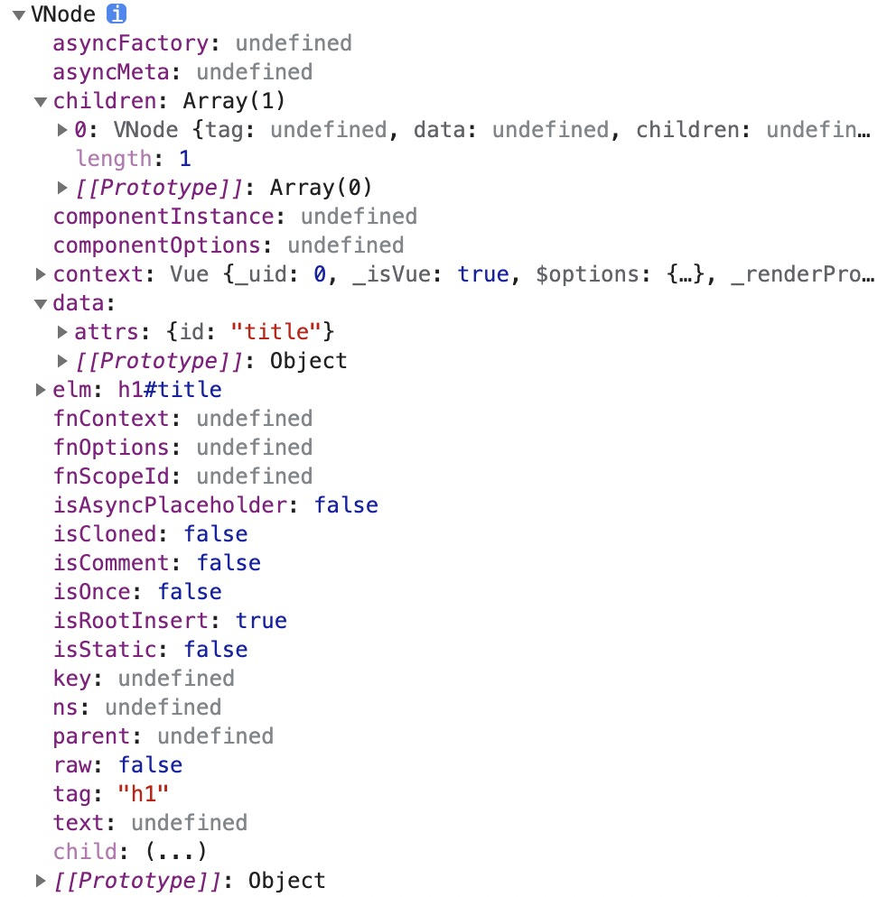

# Virtual-DOM

## 创建过程

在 vue 组件创建的过程中，我们可以通过手写 render 函数来进行。

创建方式如下所示：

```js
// example/1-virtualdom.html
const vm = new Vue({
  el: '#app',
  render (h) {
    // h(tag, data, children)
    // return h('h1', this.msg)
    // return h('h1', { domProps: { innerHTML: this.msg } })
    // return h('h1', { attrs: { id: 'title' } }, this.msg)
    const vnode = h(
      'h1', 
      { 
        attrs: { id: 'title' } 
      },
      this.msg
    )
    console.log(vnode)
    return null
  },
  data: {
    msg: 'Hello Vue'
  }
})
```

此时，我们可以通过 render 函数提供 h 函数，创建一个 vnode，并通过返回 vnode 的方法进行组件的创建。

### h 函数

- 对应于 vue 提供的 vm.$createElement(tag, data, children, normalizeChildren)
  - tag
    - 标签名称或者组件名称
  - data
    - 描述 tag，可以设置 DOM 的属性或者标签的属性
  - children
    - tag 中的文本内容或者子节点

> 详细使用：[渲染函数 & JSX — Vue.js](https://cn.vuejs.org/v2/guide/render-function.html)

### vnode

而通过 h 函数创建的 vnode，如下图所示。



其中，以下为核心属性：

- tag：标签名
- data：data 选项
- children：子节点，当最后一个参数设置为字符串时，会 自动转换成一个 vnode 对象，用来描述文本节点
- text：文本节点
- elm：记录真实 DOM
- key：用于复用元素，diff 中会使用

## 整体过程分析

## VNode 的创建过程

其核心是 createElement()，也就是 h 函数。

- 路径：src/core/vdom/create-element.js

在创建渲染 Watcher 的过程中，定义了一个 updateComponent()，updateComponent() 方法会在 watcher 实例初始化时被执行。其作用时，生成一个 虚拟 DOM，并将其映射到真实 DOM 上。

```js
// src/core/instance/lifecycle.js

updateComponent = () => {
  vm._update(vm._render(), hydrating)
}

new Watcher(vm, updateComponent, noop, {
  before () {
    if (vm._isMounted && !vm._isDestroyed) {
      callHook(vm, 'beforeUpdate')
    }
  }
}, true /* isRenderWatcher */)
```

vm._render() 的定义位于 src/core/instance/render.js 下。

```js
const { render, _parentVnode } = vm.$options
// ...
vnode = render.call(vm._renderProxy, vm.$createElement)
```

通过 call 方法，将 vm.$createElement 方法传入，及手写 render 中的 h 函数。

vm.$createElement 的定义位于src/core/instance/render.js 下。

```js
// 对编译生成的 render 进行渲染的方法
vm._c = (a, b, c, d) => createElement(vm, a, b, c, d, false)
// 对手写 render 函数进行渲染的方法
vm.$createElement = (a, b, c, d) => createElement(vm, a, b, c, d, true)
```

最终调用 createElement() 方法进行 vnode 的创建。

```js
export function createElement (
  // vue 实例
  context: Component,
  tag: any,
  data: any,
  children: any,
  normalizationType: any,
  // true：手写的 render 函数
  alwaysNormalize: boolean
): VNode | Array<VNode> {
  // 处理传入参数不同的情况
  if (Array.isArray(data) || isPrimitive(data)) {
    normalizationType = children
    children = data
    data = undefined
  }
	// normalizationType 用于处理 children 参数
  if (isTrue(alwaysNormalize)) {
    normalizationType = ALWAYS_NORMALIZE
  }
  return _createElement(context, tag, data, children, normalizationType)
}
```

在 createElement() 中，首先对传入参数个数不同的情况进行的兼容处理。

最后调用 _createElement 方法。

```js
export function _createElement (
  context: Component,
  tag?: string | Class<Component> | Function | Object,
  data?: VNodeData,
  children?: any,
  normalizationType?: number
): VNode | Array<VNode> {
  if (isDef(data) && isDef((data: any).__ob__)) {
  	// ...
    return createEmptyVNode()
  }
  // object syntax in v-bind
  // 针对动态组件 <compontent :is="current"></compontent>
  if (isDef(data) && isDef(data.is)) {
    tag = data.is
  }
  if (!tag) {
    // in case of component :is set to falsy value
    return createEmptyVNode()
  }
  // warn against non-primitive key
  if (process.env.NODE_ENV !== 'production' &&
    isDef(data) && isDef(data.key) && !isPrimitive(data.key)
  ) {
    if (!__WEEX__ || !('@binding' in data.key)) {
      warn(
        'Avoid using non-primitive value as key, ' +
        'use string/number value instead.',
        context
      )
    }
  }
  // support single function children as default scoped slot
  // 针对作用域插槽
  if (Array.isArray(children) &&
    typeof children[0] === 'function'
  ) {
    data = data || {}
    data.scopedSlots = { default: children[0] }
    children.length = 0
  }
  if (normalizationType === ALWAYS_NORMALIZE) {
    // 返回一维数组，处理用户手写的 render
    children = normalizeChildren(children)
  } else if (normalizationType === SIMPLE_NORMALIZE) {
    // 把二维数组，转换成一维数组
    children = simpleNormalizeChildren(children)
  }
  // 创建 vnode
  let vnode, ns
  if (typeof tag === 'string') {
    let Ctor
    ns = (context.$vnode && context.$vnode.ns) || config.getTagNamespace(tag)
    if (config.isReservedTag(tag)) {
      // 是否是 html 的保留标签
      // platform built-in elements
      if (process.env.NODE_ENV !== 'production' && isDef(data) && isDef(data.nativeOn) && data.tag !== 'component') {
        warn(
          `The .native modifier for v-on is only valid on components but it was used on <${tag}>.`,
          context
        )
      }
      vnode = new VNode(
        config.parsePlatformTagName(tag), data, children,
        undefined, undefined, context
      )
    } else if ((!data || !data.pre) && isDef(Ctor = resolveAsset(context.$options, 'components', tag))) {
      // 判断是否是 自定义组件
      // 查找自定义组件构造函数的声明
      // 根据 Ctor 创建组件的 vnode
      // component
      vnode = createComponent(Ctor, data, context, children, tag)
    } else {
      // unknown or unlisted namespaced elements
      // check at runtime because it may get assigned a namespace when its
      // parent normalizes children
      // 自定义标签
      vnode = new VNode(
        tag, data, children,
        undefined, undefined, context
      )
    }
  } else {
    // direct component options / constructor
    vnode = createComponent(tag, data, context, children)
  }
  if (Array.isArray(vnode)) {
    return vnode
  } else if (isDef(vnode)) {
    if (isDef(ns)) applyNS(vnode, ns)
    if (isDef(data)) registerDeepBindings(data)
    return vnode
  } else {
    return createEmptyVNode()
  }
}
```

在 _createElement() 方法中，针对 key，动态组件，作用域插槽，children 进行了处理。

之后根据 tag 的情况：

- html 的保留标签
- 自定义组件
- 自定义标签

进行响应的处理，最终返回了一个 vnode。

## update

在之前的 vm.\_render() 方法中，成功获取到了 一个 vnode 对象，之后会调用 vm.\_update 方法将 VNode 渲染为真实的 DOM。

- \_update  路径：src/core/instance/lifecycle.js

```js
  // _update 方法的作用是把 VNode 渲染成真实的 DOM
  // 首次渲染会调用，数据更新会调用
	Vue.prototype._update = function (vnode: VNode, hydrating?: boolean) {
    const vm: Component = this
    const prevEl = vm.$el
    const prevVnode = vm._vnode
    const restoreActiveInstance = setActiveInstance(vm)
    vm._vnode = vnode
    // Vue.prototype.__patch__ is injected in entry points
    // based on the rendering backend used.
    if (!prevVnode) {
      // initial render
      vm.$el = vm.__patch__(vm.$el, vnode, hydrating, false /* removeOnly */)
    } else {
      // updates
      vm.$el = vm.__patch__(prevVnode, vnode)
    }
    restoreActiveInstance()
    // update __vue__ reference
    if (prevEl) {
      prevEl.__vue__ = null
    }
    if (vm.$el) {
      vm.$el.__vue__ = vm
    }
    // if parent is an HOC, update its $el as well
    if (vm.$vnode && vm.$parent && vm.$vnode === vm.$parent._vnode) {
      vm.$parent.$el = vm.$el
    }
    // updated hook is called by the scheduler to ensure that children are
    // updated in a parent's updated hook.
  }
```

\_update 的作用是判断 prevVnode 是否存在（即当前节点是否时首次渲染），通过 vm.\_\_patch\_\_()  将 VNode 渲染为真实的 DOM。

- 不存在时，将 vm.$el 转换成 vNode，并将新的 vNode 进行比较，并将差异渲染到真实 DOM 上
- 存在时，比较新旧 vNode，并将差异更新到真实 DOM 上

## patch 函数的初始化

- 路径：src/platforms/web/runtime/index.js

```js
import { patch } from './patch'

Vue.prototype.__patch__ = inBrowser ? patch : noop
```

\_\_patch\_\_ 对应于 patch 函数。

### patch

- 路径：src/platforms/web/runtime/patch.js

```js
// nodeOps：dom 相关操作函数
import * as nodeOps from 'web/runtime/node-ops'
import { createPatchFunction } from 'core/vdom/patch'
// 处理 ref，directives
import baseModules from 'core/vdom/modules/index'
// 处理 attrs，class 等
import platformModules from 'web/runtime/modules/index'

// the directive module should be applied last, after all
// built-in modules have been applied.
const modules = platformModules.concat(baseModules)

export const patch: Function = createPatchFunction({ nodeOps, modules })
```

patch 是一个由高阶函数 createPatchFunction 返回的函数，在 createPatchFunction 函数中，对一些相关操作函数进行了缓存。

### createPatchFunction

- 路径：src/core/vdom/patch.js

```js
const hooks = ['create', 'activate', 'update', 'remove', 'destroy']

export function createPatchFunction (backend) {
	let i, j
  // 存储模块中定义的钩子函数
  const cbs = {}

  // modules 节点的属性/事件/样式的操作
  // nodeOps 节点操作
  const { modules, nodeOps } = backend

  for (i = 0; i < hooks.length; ++i) {
    // cbs['update'] = []
    cbs[hooks[i]] = []
    for (j = 0; j < modules.length; ++j) {
      if (isDef(modules[j][hooks[i]])) {
        // cbs['update'] = [updateAttrs, updateClass, ...]
        cbs[hooks[i]].push(modules[j][hooks[i]])
      }
    }
  }
  // ...
  
  // 函数柯里化，让一个函数返回一个函数
  // createPatchFunction({ nodeOps, modules }) 传入平台相关的两个参数
  return function patch (oldVnode, vnode, hydrating, removeOnly) {
    // ...
  }
}
```

在 createPatchFunction 内部，首先对各个钩子函数对应的数组进行了初始化，并将每个模块相对应的钩子函数存入其中。最后，返回 patch 函数。

## patch 函数执行过程

在 patch 的执行过程中，

- 当新的 VNode 不存在，老的 VNode 存在，执行 Destory 钩子函数。
- 老的 VNode 不存在，即调用组件的 $mount 方法，但并未传入参数，此时仅创建了存在于内存中，并未挂载到 DOM 树上。
- 新旧 VNode 都存在：
  - 旧 VNode 不为真实 DOM，且新旧节点相同：通过 patchVnode 进行 diff 对比差异，并将差异更新到真实 DOM 上。
  - 旧 VNode 是真实 DOM：将真实 DOM 先转换成 VNode，通过 createElm 将新 VNode 渲染到真实 DOM 上，后移除旧节点。
- 触发新插入的 VNode 队列的 insert 钩子函数。
- 返回新 VNode 对应的 DOM 元素。

```js
	return function patch (oldVnode, vnode, hydrating, removeOnly) {
    // 新的 VNode 不存在
    if (isUndef(vnode)) {
      // 老的 VNode 存在，执行 Destory 钩子函数
      if (isDef(oldVnode)) invokeDestroyHook(oldVnode)
      return
    }

    let isInitialPatch = false
    // 新插入的 VNode 队列，用于触发 insert 钩子函数
    const insertedVnodeQueue = []

    // 老的 VNode 不存在
    if (isUndef(oldVnode)) {
      // 调用组件的 $mount 方法，但并未传入参数，仅创建了存在于内存中，并未挂载到 DOM 树上
      // empty mount (likely as component), create new root element
      isInitialPatch = true
      // 创建
      createElm(vnode, insertedVnodeQueue)
    } else {
      // 新旧 VNode 都存在，更新
      const isRealElement = isDef(oldVnode.nodeType)
      if (!isRealElement && sameVnode(oldVnode, vnode)) {
        // 旧 VNode 不为真实 DOM，且新旧节点相同
        // 更新操作，diff 算法
        // patch existing root node
        patchVnode(oldVnode, vnode, insertedVnodeQueue, null, null, removeOnly)
      } else {
        // 旧 VNode 是真实 DOM，创建 VNode
        // 初始化
        if (isRealElement) {
          // SSR 相关 start
          // ...
          // SSR 相关 end
          // either not server-rendered, or hydration failed.
          // create an empty node and replace it
          // 将真实 DOM 转换成 VNode
          oldVnode = emptyNodeAt(oldVnode)
        }

        // replacing existing element
        // 寻找父元素
        const oldElm = oldVnode.elm
        const parentElm = nodeOps.parentNode(oldElm)

        // create new node
        // 创建 DOM 节点
        createElm(
          vnode,
          insertedVnodeQueue,
          // extremely rare edge case: do not insert if old element is in a
          // leaving transition. Only happens when combining transition +
          // keep-alive + HOCs. (#4590)
          oldElm._leaveCb ? null : parentElm,
          // 插入到此元素前
          nodeOps.nextSibling(oldElm)
        )

				// ...
        
        // destroy old node
        // 移除旧节点
        if (isDef(parentElm)) {
          removeVnodes([oldVnode], 0, 0)
        } else if (isDef(oldVnode.tag)) {
          invokeDestroyHook(oldVnode)
        }
      }
    }
    // 触发 insert 钩子函数
    invokeInsertHook(vnode, insertedVnodeQueue, isInitialPatch)
    return vnode.elm
  }
```

