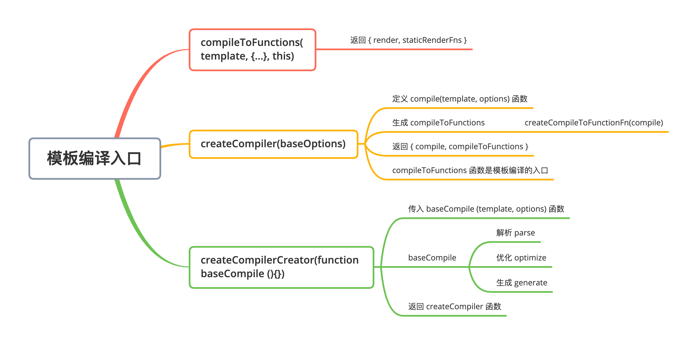
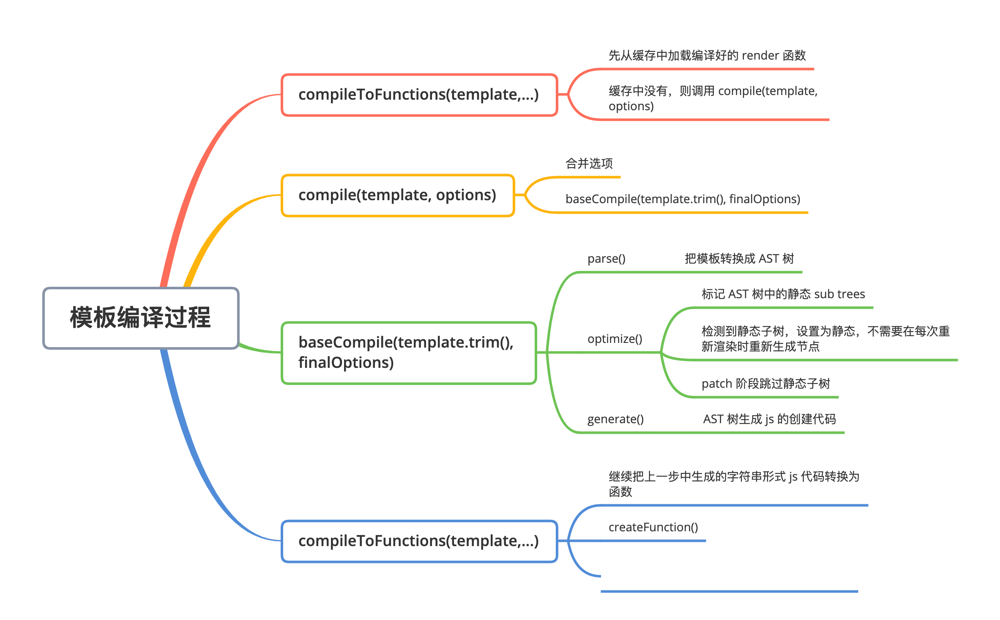

# 模版编译

模板编译的主要作用是将模板（template）转换成 渲染函数（render）。

- Vue 2.x 使用 VNode 描述视图以及各种交互，用户自己编写 VNode 比较复杂

- 用户只需要编写类似 HTML 的代码 - Vue.js 模板，通过编译器将模板转换为返回 VNode 的 render 函数

- .vue 文件会被 webpack 在构建的过程中转换成 render 函数（vue-loader）

## 编译入口

- 入口路径：src/platforms/web/entry-runtime-with-compiler.js



## 模版编译过程

### compileToFunctions

- 编译的入口函数
- 路径：src/compiler/to-function.js
- 作用：
  1. 读取缓存中的 CompiledFunctionResult 对象，如果有直接返回
  2. 把模板编译为编译对象（render，staticRenderFns），字符串形式的 js 代码
  3. 把字符串形式的 js 代码转换成 js 方法
  4. 缓存并返回 res 对象（render, staticRenderFns 方法）

```js
function createFunction (code, errors) {
  try {
    return new Function(code)
  } catch (err) {
    errors.push({ err, code })
    return noop
  }
}

export function createCompileToFunctionFn (compile: Function): Function {
  const cache = Object.create(null)

  return function compileToFunctions (
    template: string,
    options?: CompilerOptions,
    vm?: Component
  ): CompiledFunctionResult {
    options = extend({}, options)
    const warn = options.warn || baseWarn
    delete options.warn

    // ...

    // check cache
    // 1. 读取缓存中的 CompiledFunctionResult 对象，如果有直接返回
    // delimiters: 改变插槽 {{  }}
    const key = options.delimiters
      ? String(options.delimiters) + template
      : template
    if (cache[key]) {
      return cache[key]
    }

    // compile
    // 2. 把模板编译为编译对象（render，staticRenderFns），字符串形式的 js 代码
    const compiled = compile(template, options)

		// ...

    // turn code into functions
    const res = {}
    const fnGenErrors = []
    // 3. 把字符串形式的 js 代码转换成 js 方法
    res.render = createFunction(compiled.render, fnGenErrors)
    res.staticRenderFns = compiled.staticRenderFns.map(code => {
      return createFunction(code, fnGenErrors)
    })

		// ...
    
    // 缓存并返回 res 对象（render, staticRenderFns 方法）
    return (cache[key] = res)
  }
}
```

### compile

在入口函数 createCompileToFunctionFn 中，最终编译是通过 compile 函数实现。

- 路径：src/compiler/create-compiler.js
- 作用：合并选项，调用 baseCompile 进行编译，最后记录错误，返回编译好的对象。

```js
export function createCompilerCreator (baseCompile: Function): Function {
  // baseOptions 平台相关的 options
  // src/platforms/web/compiler/options.js 中定义
  return function createCompiler (baseOptions: CompilerOptions) {
    function compile (
      template: string,
      options?: CompilerOptions
    ): CompiledResult {
      const finalOptions = Object.create(baseOptions)
      // 记录编译过程中的错误
      const errors = []
      const tips = []

      let warn = (msg, range, tip) => {
        (tip ? tips : errors).push(msg)
      }

      if (options) {
        if (process.env.NODE_ENV !== 'production' && options.outputSourceRange) {
          // $flow-disable-line
          const leadingSpaceLength = template.match(/^\s*/)[0].length

          warn = (msg, range, tip) => {
            const data: WarningMessage = { msg }
            if (range) {
              if (range.start != null) {
                data.start = range.start + leadingSpaceLength
              }
              if (range.end != null) {
                data.end = range.end + leadingSpaceLength
              }
            }
            (tip ? tips : errors).push(data)
          }
        }
        // merge custom modules
        if (options.modules) {
          finalOptions.modules =
            (baseOptions.modules || []).concat(options.modules)
        }
        // merge custom directives
        if (options.directives) {
          finalOptions.directives = extend(
            Object.create(baseOptions.directives || null),
            options.directives
          )
        }
        // copy other options
        for (const key in options) {
          if (key !== 'modules' && key !== 'directives') {
            finalOptions[key] = options[key]
          }
        }
      }

      finalOptions.warn = warn

      // 编译核心函数
      const compiled = baseCompile(template.trim(), finalOptions)
      if (process.env.NODE_ENV !== 'production') {
        detectErrors(compiled.ast, warn)
      }
      compiled.errors = errors
      compiled.tips = tips
      return compiled
    }

    return {
      compile,
      compileToFunctions: createCompileToFunctionFn(compile)
    }
  }
}
```

### baseCompile

在 compile 函数中，通过 baseCompile 函数将模板编译成 render 函数。

- 路径：src/compiler/index.js
- 作用：
  1. parse：把模板转换成 ast 抽象语法树
  2. optimize：优化抽象语法树
  3. generate：把抽象语法树生成字符串形式的 js 代码

```js
export const createCompiler = createCompilerCreator(function baseCompile (
  template: string,
  options: CompilerOptions
): CompiledResult {
  // 把模板转换成 ast 抽象语法树
  // 抽象语法树，用来以树形的方式描述代码结构
  const ast = parse(template.trim(), options)
  if (options.optimize !== false) {
    // 优化抽象语法树
    optimize(ast, options)
  }
  // 把抽象语法树生成字符串形式的 js 代码
  const code = generate(ast, options)
  return {
    ast,
    // 渲染函数
    render: code.render,
    // 静态渲染函数，生成静态 VNode 树 
    staticRenderFns: code.staticRenderFns
  }
})
```

#### AST（抽象语法树）

- 抽象语法树简称 AST（Abstract Syntax Tree）
- 使用对象的形式描述树形的代码结构
- 此处的抽象语法树是用来描述树形结构的 HTML 字符串

##### 使用原因

- 模板字符串转换成 AST 后，可以通过 AST 对模板进行优化处理
- 标记模板中的静态内容，在 patch 的时候直接跳过静态内容
- 在 patch 的过程中静态内容不需要对比和重新渲染

#### parse

- 路径：src/compiler/parser/index.js
- 作用：解析器将模板解析为抽象语树 AST，只有将模板解析成 AST 后，才能基于它做优化或者生成代码字符串。

####  optimize

- 路径：src/compiler/optimizer.js
- 作用：
  - 优化抽象语法树，检测子节点中是否是纯静态节点
  - 一旦检测到纯静态节点（永远不会更改的节点）
    - 提升为常量，重新渲染的时候不在重新创建节点
    - 在 patch 的时候直接跳过静态子树

#### generate

- 路径：src/compiler/codegen/index.js
- 作用：把抽象语法树生成字符串形式的 js 代码

## 模版编译过程


